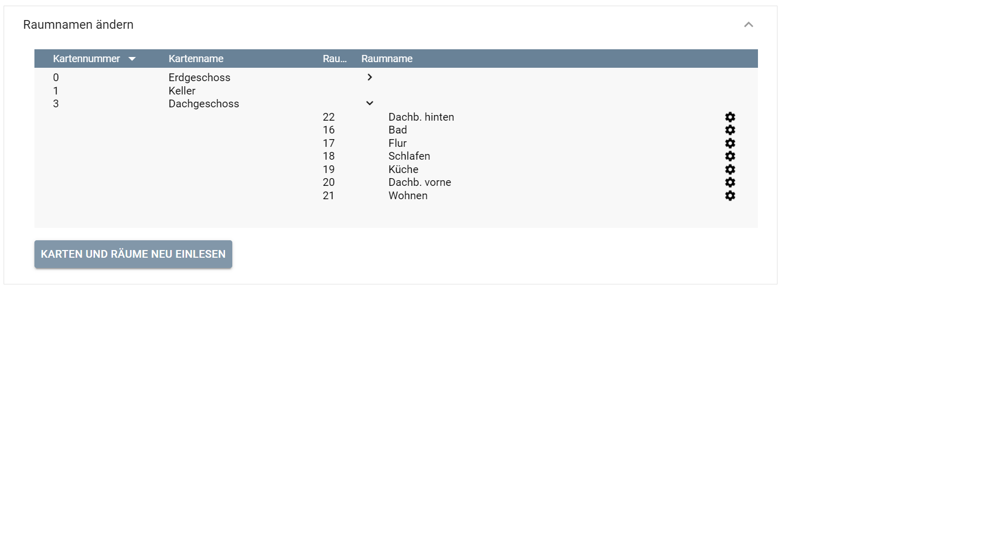
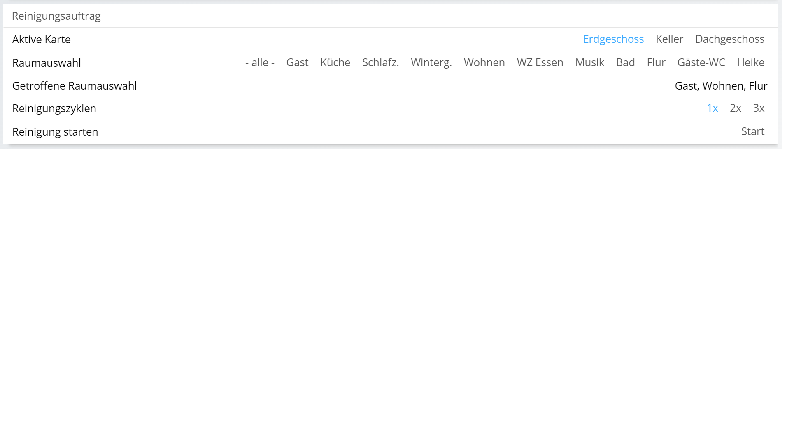

# Roborock Staubsauger Roboter
[](https://www.symcon.de/service/dokumentation/entwicklerbereich/sdk-tools/sdk-php/)

Modul für IP-Symcon ab Version 6.3

## Dokumentation

**Inhaltsverzeichnis**

1. [Funktionsumfang](#1-funktionsumfang)  
2. [Voraussetzungen](#2-voraussetzungen)  
3. [Installation](#3-installation)  
4. [Funktionsreferenz](#4-funktionsreferenz)
5. [Konfiguration](#5-konfiguration)  
6. [Anhang](#6-anhang)  

## 1. Funktionsumfang

Mit dem Modul ist es möglich, einen [Roborock](https://www.roborock.com/ "Roborock") Staubsauger-Roboter (Xiaomi) von IP-Symcon aus zu steuern. 

### Funktionen:  

 - Start / Stop / Pause der Saugfunktion 
 - Punktreinigung
 - Zurückfahren an die Aufladestation
 - Timer anzeigen und setzen
 - Einstellen von Saugleistung und Wassermenge
 - Lokalisieren des Saugers
 - Do not Disturb Mode (DND) ein-/ausschalten und Zeiten einstellen
 - Kartenwechsel (Stockwerk)
 - Raumreinigung
 - Reinigungsauftrag definieren
 - Anzeige von:
    - gereinigte Fläche
    - Summe gereinigte Fläche
    - Reinigungszeit
    - Summe der Reinigungszeit
    - Batterieleistung
    - Anzahl der Reinigungen
    - Übersicht der letzten Reinigungen
    - Ansicht des Status der Verbrauchsmaterialien
    - Seriennummer
    - Hardware Version
    - Firmware Version
    - SSID vom verbundenen WLAN
    - lokale IP Adresse
    - Modellbezeichnung
    - MAC
    - Zeitzone
	  

## 2. Voraussetzungen

- IP-Symcon 6.3
- Roborock Staubsauger-Roboter (Xiaomi)
- Das Gerät muss in der **Xiaomi Home App** (nicht Roborock App(!)) angelernt sein.

## 3. Installation

### a. Laden des Moduls

Das Modul wird über den Modul Store geladen (Modulname: Roborock). Alternativ kann es auch über das Modul Control (URL: https://github.com/bumaas/IPSymconRoborock) eingebunden werden.

### b. Einrichtung in IPS

In IP-Symcon nun _Instanz hinzufügen_ auswählen unter der Kategorie, unter der man die Instanz hinzufügen will, und _Roborock_ auswählen.


Es öffnet sich das Konfigurationsformular. Hier ist anzugeben:
 - IP-Adresse des Saugers
 - Logindaten für das Xiaomi Konto 

Optional können die Statusvariablen ausgewählt werden sowie Pushnachrichten definiert werden.

Hinweis: Wenn Xiaomi eine Zwei-Faktor-Authentifizierung verlangt, erscheint ein Verifizierungs-Pop-up. Dort den Code per E-Mail/SMS anfordern und eingeben, dann wird der Login fortgesetzt.

Im Expertenbereich kann das Aktualisierungsintervall (Standard ist 60 s) modifiziert werden. Es sollte nicht zu niedrig gesetzt werden, da die Kommunikation mit dem Gerät recht langsam ist. Zudem kann ein abweichender Server angegeben werden, von dem das Token bezogen werden soll. Für China kann 'cn' angegeben werden, oder er kann leer gelassen werden. Standard ist 'de'.

Im Aktionsbereich des Formulars können die Statusvariablen getestet werden ("Testbereich"). 

Unter "Raumnamen ändern" (sichtbar, wenn die Statusvariablen für einen _Reinigungsauftrag_ ausgewählt wurden) können die in der Xiaomi App definierten Räume übernommen und anschließend die Räume mit Namen versehen werden. Leider gibt es bislang keinen (mir) bekannten Weg, die Namen auszulesen.
<br>Zusätzlich lassen sich über _ignorieren_ auch Räume von der Raumauswahl ausschließen.

Hinweis: beim Einlesen werden immer die Räume der aktuell geladenen Karte eingelesen.

Falls die Statusvariable _Kartenbild_ ausgewählt wurde, werden zusätzliche Funktionen zum Holen der Karte und zum Anzeigen angeboten.

**Reinigungsauftrag definieren**

Falls die Option _Reinigungsauftrag_ gewählt wurde, werden die notwendigen Variablen und Profile zum Absetzen eines umfangreichen Reinigungsauftrages zur Verfügung gestellt.

Beispiel einer Darstellung im Webfront:



## 4. Funktionsreferenz

### Roborock Staubsauger Roboter:

Für alle Funktionen gilt: der Parameter _$InstanceID_ ist die __*ObjektID*__ der Roborock Instanz

 _**Startet den Reinigungsvorgang**_
  
 ```php
 Roborock_Start($InstanceID);
 ```   
 
 _**Startet die Reinigung eines Raumes**_
  
 ```php
 Roborock_Start_Segment_Clean(int $InstanceID, int $segmentid);
 ```   
  
 $segmentid: ID des zu reinigenden Raumes

_**Startet die Reinigung einer Liste von Räumen**_

 ```php
 Roborock_Start_Segment_Clean_ex(int $InstanceID, string $segmentIds);
 ```   

Es kann entweder eine JSON kodierte Liste der zu reinigenden Räume (Segmente) angegeben werden
```
$segmentIDs = json_encode ([16, 17, 18]);
```

oder es kann zusätzlich eine Anzahl an Wiederholungen mitgegeben werden
```php
$segmentIds = json_encode ([['segments' => [16, 17, 18], 'repeat' => 2]]);
```

Die vorhandenen Räume lassen sich über die Funktion Roborock_Get_Room_Mapping ermitteln.

_**Liste von Räumen holen**_

 ```php
 Roborock_Get_Room_Mapping(int $InstanceID): array;
 ```   

 _**Stoppt den Reinigungsvorgang**_
  
 ```php
 Roborock_Stop($InstanceID);
 ```   
 
  _**Pausiert den Reinigungsvorgang**_
   
 ```php
 Roborock_Pause($InstanceID);
 ```   
  
  _**Fährt zum Aufladen zur Ladestation**_
    
 ```php
 Roborock_Charge($InstanceID);
 ```   
  
 _**Weist den Sauger an sich mit einem Sound zur Lokalisierung zu melden**_
    
 ```php
 Roborock_Locate($InstanceID);
 ```   
   
 _**Startet eine Reinigung um den Standort des Saugers**_
    
 ```php
 Roborock_CleanSpot($InstanceID);
 ```   
   
  _**Liest den Status vom Roborock aus**_
     
 ```php
 Roborock_Get_State($InstanceID): array;
 ```   
  Gibt zurück:
 - Batterieladung
 - Reinigungsfläche
 - Reinigungszeit
 - DND Status
 - Lüfterleistung
  
 _**Seriennummer des Roborock**_
      
 ```php
 Roborock_Get_Serial_Number($InstanceID): string;
 ```   
     
 _**Liest Zustand der Verbrauchsgegenstände aus**_
       
 ```php
 Roborock_Get_Consumables($InstanceID): array;
 ```   
 
 _**Liest Zusammenfassung der Reinigung aus**_
        
  ```php
  Roborock_GetCleanSummary($InstanceID): array;
  ```   
  
 _**Liest Status Do Not Disturb Mode aus**_
          
 ```php
 Roborock_Get_DND_Mode($InstanceID): array;
 ```   
 
_**Zum Zurücksetzen der Verbrauchsmaterialien**_
```php
Roborock_Reset_Filter($InstanceID);
Roborock_Reset_Mainbrush($InstanceID);
Roborock_Reset_Sidebrush($InstanceID);
Roborock_Reset_Sensors($InstanceID);
```

## 5. Konfiguration:

### Eigenschaften:

| Eigenschaft |   Typ   | Standardwert |                    Funktion                    |
|:-----------:|:-------:|:------------:|:----------------------------------------------:|
|    host     | string  |              |  IP Adresse des Roborock Staubsauger Roboters  |
|    token    | integer |              | Token aus der MI App, Länge 32 oder 96 Zeichen |


## 6. Anhang

###  a. Funktionen:

#### Roborock Staubsauger Roboter:

 _**Startet den Reinigungsvorgang**_
  
 ```php
 Roborock_Start($InstanceID);
 ```   
 
 Parameter _$InstanceID_ __*ObjektID*__ der Roborock Instanz
	
 _**Stoppt den Reinigungsvorgang**_
  
 ```php
 Roborock_Stop($InstanceID);
 ```   
 
 Parameter _$InstanceID_ __*ObjektID*__ der Roborock Instanz
 
 _**Pausiert den Reinigungsvorgang**_
   
 ```php
 Roborock_Pause($InstanceID);
 ```   
  
 Parameter _$InstanceID_ __*ObjektID*__ der Roborock Instanz
  
 _**Fährt zum Aufladen zur Ladestation**_
    
 ```php
 Roborock_Charge($InstanceID);
 ```   
   
 Parameter _$InstanceID_ __*ObjektID*__ der Roborock Instanz
   
 _**Weist den Sauger an sich mit einem Sound zur Lokalisierung zu melden**_
    
 ```php
 Roborock_Locate($InstanceID);
 ```   
   
 Parameter _$InstanceID_ __*ObjektID*__ der Roborock Instanz

 _**Startet eine Reinigung um den Standort des Saugers**_
    
 ```php
 Roborock_CleanSpot($InstanceID);
 ```   
   
 Parameter _$InstanceID_ __*ObjektID*__ der Roborock Instanz
 
 
 _**Liest den Status vom Roborock aus**_
     
 ```php
 Roborock_Get_State($InstanceID);
 ```   
    
 Parameter _$InstanceID_ __*ObjektID*__ der Roborock Instanz  
 
 Gibt zurück:
 - Batterieladung
 - Reinigungsfläche
 - Reinigungszeit
 - DND Status
 - Lüfterleistung
  
 _**Seriennummer des Roborock**_
      
 ```php
 Roborock_Get_Serial_Number($InstanceID): string;
 ```   
     
 Parameter _$InstanceID_ __*ObjektID*__ der Roborock Instanz  
   
 _**Liest Zustand der Verbrauchsgegenstände aus**_
       
 ```php
 Roborock_Get_Consumables($InstanceID): array;
 ```   
      
 Parameter _$InstanceID_ __*ObjektID*__ der Roborock Instanz  
 
 _**Liest Zusammenfassung der Reinigung aus**_
        
  ```php
  Roborock_GetCleanSummary($InstanceID): array;
  ```   
       
 Parameter _$InstanceID_ __*ObjektID*__ der Roborock Instanz
  
 _**Liest Status Do Not Disturb Mode aus**_
          
 ```php
 Roborock_Get_DND_Mode($InstanceID): array;
 ```   
         
 Parameter _$InstanceID_ __*ObjektID*__ der Roborock Instanz     

 _**Stellt die Saugleistung des Staubsaugerroboters ein**_
          
 ```php
 Roborock_Set_Fan_Power(integer $InstanceID, integer $power);
 ```   
         
 Parameter _$InstanceID_ __*ObjektID*__ der Roborock Instanz

 Parameter _$power_ Wert von 0 - 100 zum Einstellen der Leistung     

_**Reinigt in der Zone der angegebenen Koordinaten**_
          
 ```php
 Roborock_ZoneClean(integer $InstanceID, integer $lower_left_corner_x, integer $lower_left_corner_y, integer $upper_right_corner_x, integer $upper_right_corner_y, integer $number);
 ```   
         
 Parameter _$InstanceID_ __*ObjektID*__ der Roborock Instanz 
 
 Parameter _$lower_left_corner_x_ __X-Koordinate der linken unteren Ecke__ der Reinigungszone (Rechteck)
 
 Parameter _$lower_left_corner_y_ __Y-Koordinate der linken unteren Ecke__ der Reinigungszone (Rechteck)
   
 Parameter _$upper_right_corner_x_ __X-Koordinate der oberen rechten Ecke__ der Reinigungszone (Rechteck)
 
 Parameter _$upper_right_corner_y_ __Y-Koordinate der oberen rechten Ecke__ der Reinigungszone (Rechteck)
 
 Parameter _$number_ __Anzahl der Reinigungen__ 
 
 _**Reinigt mehrere Zonen mit den angegebenen Koordinaten**_
 
  ```php
  Roborock_ZoneCleanMulti(integer $InstanceID, string $multizone);
  ```   
          
  Parameter _$InstanceID_ __*ObjektID*__ der Roborock Instanz 
  
  Parameter _$multizone_ __JSON String__ mit mehreren Zonen
  
  Beispiel:
  
  _Zone 1:_
  
  Parameter _$lower_left_corner_x_ __X-Koordinate der linken unteren Ecke__ der Reinigungszone (Rechteck)
  
  Parameter _$lower_left_corner_y_ __Y-Koordinate der linken unteren Ecke__ der Reinigungszone (Rechteck)
    
  Parameter _$upper_right_corner_x_ __X-Koordinate der oberen rechten Ecke__ der Reinigungszone (Rechteck)
  
  Parameter _$upper_right_corner_y_ __Y-Koordinate der oberen rechten Ecke__ der Reinigungszone (Rechteck)
  
  Parameter _$number_ __Anzahl der Reinigungen__ 
  
  _Zone 2:_
  
  Parameter _$lower_left_corner_x1_ __X-Koordinate der linken unteren Ecke__ der Reinigungszone (Rechteck)
  
  Parameter _$lower_left_corner_y1_ __Y-Koordinate der linken unteren Ecke__ der Reinigungszone (Rechteck)
    
  Parameter _$upper_right_corner_x1_ __X-Koordinate der oberen rechten Ecke__ der Reinigungszone (Rechteck)
  
  Parameter _$upper_right_corner_y1_ __Y-Koordinate der oberen rechten Ecke__ der Reinigungszone (Rechteck)
  
  Parameter _$number1_ __Anzahl der Reinigungen__ 
 
   ```php
   $InstanceID = 12345;
   $multizone = [
   [$lower_left_corner_x, $lower_left_corner_y, $upper_right_corner_x, $upper_right_corner_y, $number],
   [$lower_left_corner_x1, $lower_left_corner_y1, $upper_right_corner_x1, $upper_right_corner_y1, $number1]
   ];
   $multizone = json_encode($multizone);
   Roborock_ZoneCleanMulti($InstanceID, $multizone);
   ```   
  
_**Fährt zu den angegebenen Koordinaten**_
          
 ```php
 Roborock_GotoTarget(integer $InstanceID, integer $x, integer $y);
 ```   
         
 Parameter _$InstanceID_ __*ObjektID*__ der Roborock Instanz
 
 Parameter _$x_ __*X-Koordinate*__ der Zielposition
 
 Parameter _$y_ __*Y-Koordinate*__ der Zielposition 

Hinweis: die Basisstation hat die Koordinaten 2550, 2550. Eine Einheit entspricht ungefähr einem Millimeter.

_**Holt die Karte**_

 ```php
 Roborock_GetMap(integer $InstanceID): bool;
 ```   

Parameter _$InstanceID_ __*ObjektID*__ der Roborock Instanz


###  b. GUIDs und Datenaustausch:

#### Roborock:

GUID: `{E65614FB-B37A-219A-4876-E5676C948C33}` 

### c. Quellen

[OpenMiHome](https://github.com/OpenMiHome/mihome-binary-protocol/blob/master/doc/PROTOCOL.md "OpenMiHome") _Wolfgang Frisch_ (GPLv3)

[Dustcloud](https://github.com/dgiese/dustcloud-documentation "Dustcloud") _Dennis Giese_ & _Daniel Wegemer_ (GPLv3)
